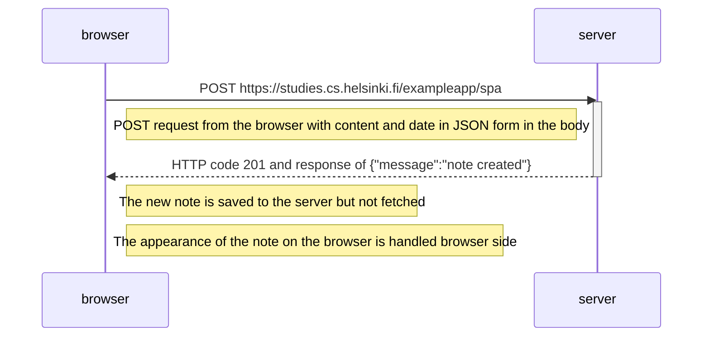

```mermaid
sequenceDiagram
    participant browser
    participant server
    
    browser->>server: POST https://studies.cs.helsinki.fi/exampleapp/spa
    activate server

    Note right of browser: POST request from the browser with content and date in JSON form in the body

    server-->>browser: HTTP code 201 and response of {"message":"note created"}
    deactivate server

    Note right of browser: The new note is saved to the server but not fetched 
    Note right of browser: The appearance of the note on the browser is handled browser side
```